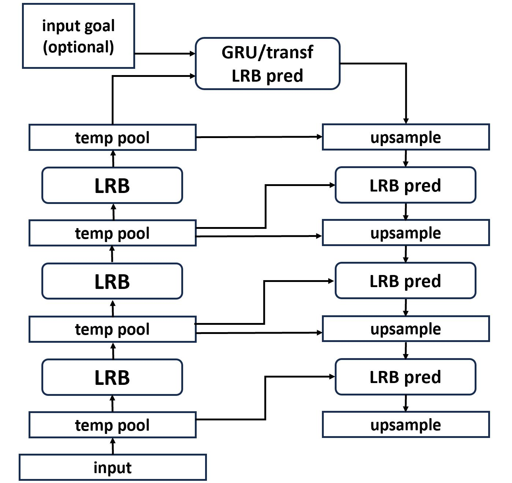
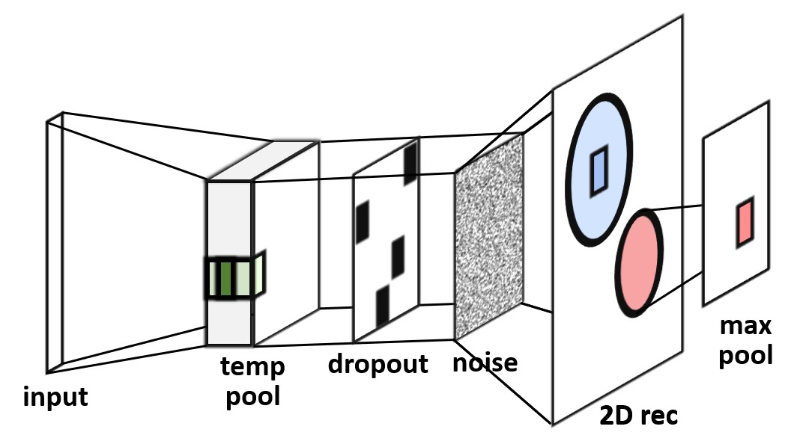

# Recognizing Human Actions and Goals in an Open Environment: A Brain-Inspired Approach

This repository contains the main code developed during my PhD. This work mainly consisted of the development of a novel action and goal recognition system that, by drawing inspiration from our brain structure and operation, would be better fitted to real dynamic environments than other ML systems, which typically struggle in these kinds of contexts (where humans excel). The system was designed not to be very specific to the application of action and goal recognition, but rather to mimic the underlying processes in the brain from which this and other behaviors emerge. This makes the system better adapted to real environments where reaching a good recognition performance is in general not enough, and different additional skills may be required depending on the specific situation. Indeed, the resultant brain-like system is naturally adaptable and extendable to different scenarios where, e.g., continuous learning is required, to related applications such as action and goal prediction and selection, and even to other domains.

The complete system developed, known as U-shaped locally recurrent neural network (**U-LRNN**), takes the form of an encoder-decoder architecture:

<p align="center"></p>

In this system, the encoder, also known as hierarchical locally recurrent neural network (**HLRNN**), learns, in a self-supervised way, representations of its input at different levels of abstraction. The decoder, on the other hand, can be used for prediction and action selection. The encoder is basically a stack of locally recurrent blocks (LRBs), which are shallow self-supervised representation learning systems for temporal data (and an updated version of the earlier neocortex-inspired locally recurrent neural network, **NILRNN**, designed as an efficient model of the feedforward circuits in areas of the neocortex):

<p align="center"></p>

The PhD dissertation and presentation describing the complete system are available in this repository in the `docs` directory. In particular:

- **NILRNN** is described in chapter 3 of the dissertation and in papers:
	- Van-Horenbeke, Franz A., and Angelika Peer. "NILRNN: a neocortex-inspired locally recurrent neural network for unsupervised feature learning in sequential data." _Cognitive Computation_ 15.5 (2023): 1549-1565.
	- Van-Horenbeke, Franz A., and Angelika Peer. "The Neocortex-Inspired Locally Recurrent Neural Network (NILRNN) as a Model of the Primary Visual Cortex." _IFIP International Conference on Artificial Intelligence Applications and Innovations_. Cham: Springer International Publishing, 2022.
- **HLRNN** is described in chapter 4 of the dissertation (and in a paper under review).
- **U-LRNN** is described in chapter 5 of the dissertation.

Please refer to those documents for more information on the system itself. The rest of this document focuses on the code.

## Code description

The main part of the code is written in Python and relies on the PyTorch library. These files are in the root directory of this repository. Most of them contain a main function with example code on how to use their classes and functions. A brief description of these Python modules is provided below:

- **`lrnn`**: It contains the definition of most neural networks, layers, and cost functions used in this work. It also contains the definition of a container class, which can be seen as an extension of `torch.nn.Sequential`, that enables the combination of modules with different numbers of inputs and outputs and working at different timescales in arbitrary ways, implementing also closed-loop functionality. This class has been used to build HLRNNs and U-LRNNs.
- **`attention`**: It contains the definition of the input attention system.
- **`actionselection`**: It contains the implementation of the synthetic action and plan simulation environment and of the corresponding action selection evaluation tools.
- **`lrnntune`**: It contains functionality that enables a greedy hyperparameter search and training of the hierarchy, starting from the lower blocks and going gradually up. These tools can be combined with a hyperparameter tuning library such as Ray Tune.
- **`inputdata`**: It contains the definition of PyTorch datasets for most of the input data used in this work. Information on how to set up these datasets is provided in the next section.
- **`kitdata`**: It contains the definition of PyTorch datasets for the KIT Whole-Body Human Motion Database. Information on how to set up these datasets is provided in the next section.
- **`kitdatavis`**: It contains functionality to visualize the datasets in module `kitdata`. This functionality is implemented in a separate module to avoid the dependency of the dataset module on 3D plotting libraries.

## Setting up the datasets

Arguably, this is the messier part to set up this code. Alternatively, one can adapt and use their own sequential datasets (the code doesn't accept batched sequences, see next section). The setting up is different for the two modules:

### `inputdata`

Since this code was originally implemented in MATLAB (the Python code basically consists of MATLAB wrappers), running it requires having MATLAB installed, as well as having the MATLAB engine API for Python installed. You can follow [these instructions](https://www.mathworks.com/help/matlab/matlab_external/install-the-matlab-engine-for-python.html) to install this engine.

On the other hand, the data to be used needs to be copied to directory `datasets` of this repository:

- `SynthPlanInput`/`SynthActInput`don't require any data, as the data is generated synthetically in the MATLAB code.
- `WardInput` data can be downloaded from [this link](https://people.eecs.berkeley.edu/~yang/software/WAR/WARD1.zip). Once downloaded, unzip it to directory `datasets`.
- `FsddInput` data can be obtained by cloning [this repo](https://github.com/Jakobovski/free-spoken-digit-dataset) directly to directory `datasets`.
- `ShiftedImgInput`data can be downloaded from [this link](https://web.stanford.edu/class/cs294a/cs294a_2011assgn.tar.gz). Once downloaded, extract file `IMAGES.mat`and copy it to directory `datasets`.

### `kitdata`

The Extended KIT Bimanual Manipulation Dataset can be downloaded from [this link](https://motion-database.humanoids.kit.edu/file_download/88822/) (previous registration is required). Note however that the dataset in this link does not include the recordings that were specifically captured for this work (described in section 5.2.1 of the dissertation). Some of these new recordings are already shown on [this website](https://motion-database.humanoids.kit.edu/list/motions/), but require special permissions to be downloaded (you can contact the owner of the database if interested).

Within the downloaded dataset, the recordings can be found in directory `motions`. However, these recordings are in a proprietary format. To convert them to the CSV format that the Python module in this repository expects to find, you can follow the next steps:

- Install the KIT Axii tool following the instructions in [this link](https://gitlab.com/ArmarX/meta/setup) (preferably, in an Ubuntu machine).
- Before running command `axii workspace upgrade`, configure your Axii workspace to have the required modules with the following commands:
```
axii workspace remove armarx
axii workspace add mmm/tools
axii workspace add mplib
axii workspace upgrade
```
- Go to directory ```mmm/tools``` inside your Axii workspace and copy there directory `MMSegmentwiseCSVExporter` from this repository.
- Configure and build the C++ code in this directory.
- Go to directory `mmm/tools/build/bin` and run command `./MMMSegmentwiseCSVExporter --motionFile [dataset motions directory] --outputDir [output directory]`.
- Name output directory `kit` and copy it to directory `datasets` of this repository.

This process is likely not to work on the first try and some tweaking is probably required.

To **visualize** this data, the 3D models of the objects are also required. Most of these models can be found in the dataset file in directory `objects`. These models need to be copied, in STL format, to directory `datasets/kit/models`.  For some objects, there may be different models with different sizes or orientations. Therefore, if the object behaves in strange ways when visualizing the recordings, you may be using the wrong model. Regarding the models not included in the dataset file, the new ones can already be found in directory `datasets/kit/models`, and the others can be downloaded from the following links: [`mixing_bowl_big`](https://motion-database.humanoids.kit.edu/file_download/16295/), [`hand`](https://free3d.com/3d-model/hand-v1--945174.html), [`head`](https://free3d.com/3d-model/femalehead-v4--971578.html), and [`torso`](https://free3d.com/3d-model/maletorso-v1--121321.html) (the names of the model files without extension should be the same as the object names found in module `kitdata` and in the CSV files).

## Code limitations

This section refers to limitations that are specific to the code. For information on system limitations, please refer to the dissertation.

- The NILRNN with partially connected input (used for the behavior comparison with the primary visual cortex) is not implemented in this version of the code.
- The layers and networks in this code are designed to work with non-batched sequences (module `lrnntune`can also work with batched sequences).
- Module `lrnntune` generates the "global" hyperparameter and hidden state names by joining the block names and generic hyperparameter and hidden state names into a string using `_`as a separator. Therefore, a poor choice of the names could lead to ambiguous global names.
- The code is designed to work with batch sizes that are multiple of the accumulated downsample factors at all the blocks being used. To obtain these batch sizes, the code assumes that the maximum of these factors is multiple of all the others.
- The closed-loop functionality in module `lrnn`has several limitations: A system working in a closed-loop configuration can only take as input its closed-loop output, the regular output needs to be at the same timescale as the input and closed-loop output, and the blocks can only work at timescales with integer accumulated downsample factors (with respect to the input).

There are also some limitations (not code-specific) regarding the synthetic action and plan simulation environment (related to how the original synthetic data is generated) and the KIT data reconstruction for visualization (related to how the data is stored/coded). These limitations are described in the doctrings of modules `actionselection` and `kitdata`, respectively.
